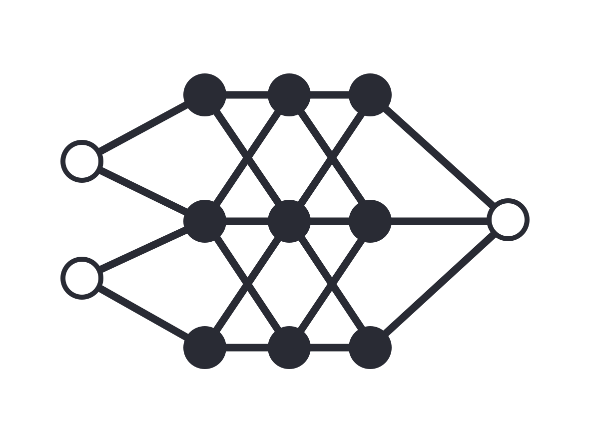

# Neural Networks: Revolutionizing AI with Mechanical Brains

Neural Networks are fascinating, aren't they? In fact, the title above was written by one. But how can a machine learn? This is why I created this page, to explore the remarkable phenomenon of machine learning and unravel the intricate workings of neural networks.
